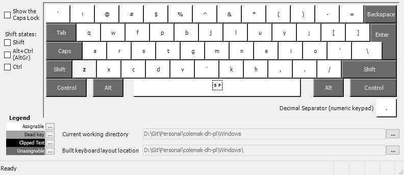
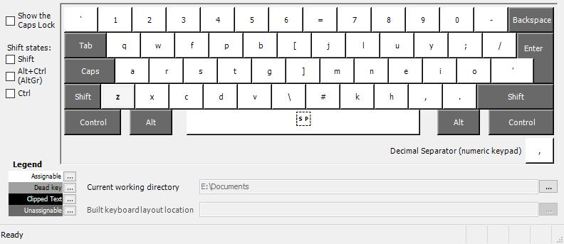

## Usage
1. Clone the repo
2. Run `klc-install.exe install {Path_to_layout_file}`
3. Profit

## The layout
This is how the layout looks in the MSKLC utillity window.  
The shortcut buttons are not altered from the QWERTY layout and do not match the re-organised letters of the typing layout.

### Programmers

### Wide

# Credits
TheChilliPL - thanks for the [klc-install](https://github.com/TheChilliPL/klc-install) tool, completely eliminating hustling with MSKLC <3