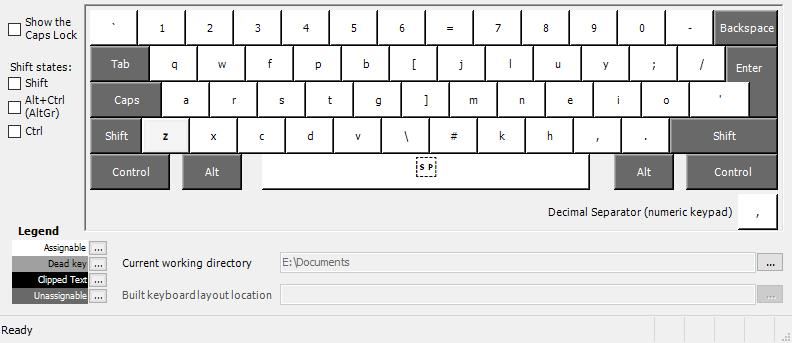

## The layout
This is how the layout looks in the MSKLC utillity window.  
The shortcut buttons are not altered from the QWERTY layout and do not match the re-organised letters of the typing layout.
